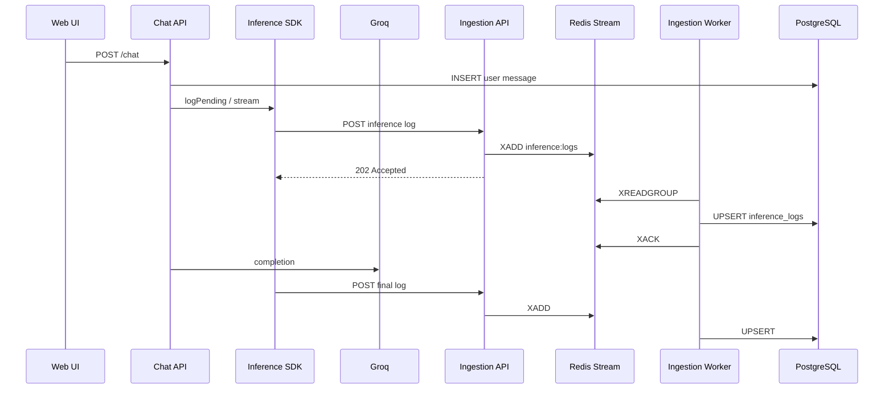

# Architecture Notes

## Ingestion flow (event-driven)

1. User sends a message via the React UI to the **Chat API**.
2. Chat API persists the user message in PostgreSQL.
3. Chat API invokes the LLM through the **Inference SDK** `wrap()` or streaming path.
4. SDK emits a `pending` log immediately, then a final log (`success`, `error`, or `cancelled`).
5. SDK **POSTs** to **Ingestion API** `POST /v1/inference-logs` (fire-and-forget, ~3s timeout, retries).
6. Ingestion API **validates** (Pydantic) and **enqueues** the payload to **Redis Stream** `inference:logs` → returns **HTTP 202**.
7. **Ingestion worker** (`worker.py`) consumes from the stream (consumer group `ingestion-workers`) and **upserts** into `inference_logs`.
8. Dashboard reads aggregates via `GET /v1/metrics/summary` (SQL over persisted rows).

## Why event-based ingestion?

| Benefit | How |
|---------|-----|
| **Decouple write path** | HTTP handler only validates + enqueues (~ms), not DB-bound |
| **Absorb spikes** | Redis buffers if Postgres is slow |
| **Scale workers** | Run multiple `ingestion-worker` containers with same consumer group |
| **Resilience** | Unacked messages stay in pending; worker retries on failure |

Set `USE_EVENT_QUEUE=false` to fall back to synchronous DB write in the API (useful for local debugging without Redis).

## Logging strategy

- **Two-phase logs**: `pending` at request start, final status on completion.
- **Non-blocking**: SDK `sendAsync()` never blocks chat.
- **Previews only**: truncated + PII redaction in `redact.ts`.
- **Degraded mode**: if Redis or ingestion is down, SDK warns; chat continues.

## Scaling considerations

- **Chat API** and **Ingestion API** scale horizontally (stateless).
- **Workers** scale horizontally (same Redis consumer group; messages partition across consumers).
- **Redis**: Redis Cluster / managed Redis for HA; monitor stream length and pending count.
- **PostgreSQL**: connection pooling; read replica for dashboards.
- **Batch endpoint** (future): `POST /v1/inference-logs/batch` publishing multiple XADDs.

## Failure handling assumptions

| Failure | Behavior |
|---------|----------|
| Redis down | Ingestion returns **503**; SDK retries then warns |
| Worker down | Logs accumulate in stream; processed when worker returns |
| Worker DB error | Message **not ACKed**; redelivered to consumer group |
| Invalid payload | API returns **422** before enqueue |
| Duplicate `log_id` | Upsert on persist — idempotent |
| Ingestion unreachable | Chat unaffected |

## Component responsibilities

| Component | Language | Role |
|-----------|----------|------|
| `packages/inference-sdk` | TypeScript | Wrap LLM calls, POST logs to ingestion |
| `apps/chat-api` | Node.js | Chat, providers, SDK integration |
| `apps/ingestion-api` | Python | HTTP validate + Redis enqueue |
| `apps/ingestion-api/worker.py` | Python | Redis consumer → Postgres |
| `apps/ingestion-api/events/redis_queue.py` | Python | Stream publish/consume/ack |
| `apps/web` | React | UI + dashboard |
| `redis` (Docker) | — | Event bus |
| `db/init.sql` | SQL | Schema |

## Multi-provider

| Provider | File | API |
|----------|------|-----|
| Groq | `groq.ts` | OpenAI-compatible |
| OpenAI | `openai.ts` | OpenAI-compatible |
| Gemini | `gemini.ts` | `@google/generative-ai` |
| Anthropic | `anthropic.ts` | `@anthropic-ai/sdk` |

- Registry: `providers/registry.ts` — env keys and default models.
- Factory: `createProvider(providerId?, model?)` — used by chat route; validates API key.
- UI: `GET /api/providers` + dropdown; each message sends `{ provider: "gemini" }`.
- Inference logs record actual `provider` + `model` per request ( comparable in dashboard / DBeaver ).
